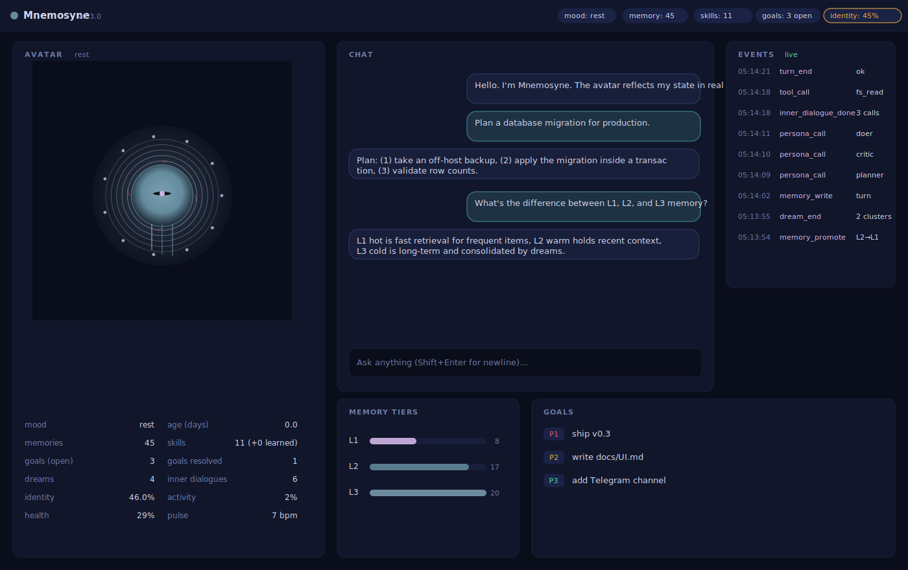
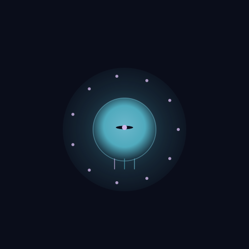
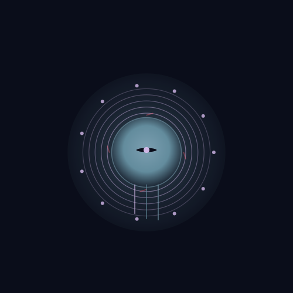

# Mnemosyne UI

Browser dashboard. Single-page, vanilla JS, served by `mnemosyne-serve`.
No build step, no framework, no dependencies beyond what `mnemosyne-serve`
already brings in.



## Quick start

```sh
pip install -e .
mnemosyne-serve --port 8484 &           # daemon owns the memory store
open http://127.0.0.1:8484/ui            # dashboard
```

If you want bearer-token auth:

```sh
MNEMOSYNE_SERVE_TOKEN=hunter2 mnemosyne-serve --port 8484 &
# then in the browser console: localStorage.setItem('mnemosyne.token','hunter2')
```

## What you see

Six panels arranged in a responsive grid:

- **Avatar (left)** — SVG that visualizes the agent's current state. See
  [Avatar visual contract](#avatar-visual-contract) for what each
  element represents.
- **Chat (middle top)** — POSTs to `/turn`. The "hard turn (inner
  dialogue)" toggle adds `metadata.tags=["hard"]` so the brain takes
  the Planner → Critic → Doer path.
- **Events (right)** — SSE-streamed `events.jsonl` rows from the
  daemon's run. Falls back to polling when an auth token is set
  (EventSource can't carry custom headers).
- **Memory tiers (bottom middle)** — L1 hot / L2 warm / L3 cold counts
  with proportional bars.
- **Goals (bottom right)** — open goals from `goals.jsonl`. Add and
  resolve inline.

The **status pills** in the topbar show: mood phase, memory count,
skills count, open-goals count, identity strength %.

## Avatar visual contract

Every visual element maps to one observable agent trait. No magic, no
opaque "personality engine."

| Element | Trait | Source |
|---|---|---|
| **Aura halo (breathing)** | `pulses_per_minute` derived from recent activity | derived in `mnemosyne_avatar.py` |
| **Core orb size + brightness** | `health` (composite of identity strength + activity) | derived |
| **Concentric rings** | `rings` = inner-dialogue activations (capped 8) | `inner_dialogue_done` events |
| **Orbiting dots** | `skills_count` (capped 12) | skill registry size |
| **Eye openness** | `mood_phase` ("focus" wide, "rest" narrow) | derived |
| **Memory roots (3 lines down)** | `l1_count`, `l2_count`, `l3_count` log-scaled | `memory.db` row counts |
| **Red rim scars** | `identity_slip_count` | `identity_slip_detected` events |
| **Consolidate-mode petals** | only when `mood_phase=="consolidate"` | dream cadence > inner cadence |
| **Color palette** | `palette.{core, accent, rim, bg}` derived from health × activity | deterministic mapping |

Two examples:

| Resting (empty agent) | Active (memories, dreams, slips, inner-dialogue) |
|---|---|
|  |  |

## Schema versioning (AGI-scaling brief)

The avatar state JSON carries `schema_version: 1`. Future additions
are append-only — keys never get renamed or removed. Old `avatar.json`
files load forever, and old UI code keeps rendering old states without
rebuilding.

Reserved-but-unset slots in v1 (always present, populated `null` until
we have an honest way to compute them):

- `wisdom` — agreement with self over time (does the agent contradict
  past memories?)
- `restlessness` — variance in inter-turn gap
- `novelty` — rate of new skills learned per week
- `self_assessment` — result of the Evaluator persona scoring the
  Doer's output

Each of these would become a new visual element in `avatar.js` without
breaking anything that already exists.

## Architecture

```
   +----- browser ---------------------------------------+
   |  index.html                                          |
   |  ├─ avatar.js  ── builds SVG from /avatar JSON       |
   |  └─ app.js     ── polls /avatar /stats /goals        |
   |                  ── SSE /events_stream               |
   |                  ── POST /turn /goals                |
   +-------------------- HTTP / SSE ----------------------+
                          │
   +----- mnemosyne-serve --------------------------------+
   |  GET  /ui                 → static HTML              |
   |  GET  /ui/static/*        → CSS, JS, SVG             |
   |  GET  /avatar             → mnemosyne_avatar.compute_state |
   |  GET  /events_stream      → tails events.jsonl (SSE) |
   |  GET  /stats /goals       → existing JSON endpoints  |
   |  POST /turn /goals /dream → existing handlers        |
   +-------+----------------------------+-----------------+
           │                            │
   mnemosyne_avatar.py        Brain + MemoryStore + telemetry
   (state derived from        (single shared instance owned
    memory.db + events.jsonl)  by the daemon)
```

## Endpoints added by the UI work

| Endpoint | Purpose | Module |
|---|---|---|
| `GET /ui` | dashboard HTML | `mnemosyne_serve._serve_ui_index` |
| `GET /ui/static/*` | CSS / JS / SVG (path-traversal rejected) | `_serve_static` |
| `GET /avatar` | current `compute_state()` JSON | `Service.handle_avatar` |
| `GET /events_stream` | Server-Sent Events tail of run's events.jsonl | `_stream_events` |

Existing endpoints (`/turn`, `/stats`, `/goals`, `/recent_events`,
`/healthz`, etc.) are unchanged and consumed by `app.js`.

## Security

- **Bind address.** Defaults to `127.0.0.1`. Override with `--host`
  only if you trust your network.
- **Bearer token.** `MNEMOSYNE_SERVE_TOKEN=…` (or `--token …`)
  protects every endpoint *except* the SSE stream — `EventSource`
  cannot send custom headers, so when a token is set the UI falls
  back to polling `/recent_events` over `Authorization: Bearer …`.
- **Static path traversal.** `/ui/static/<path>` is resolved against
  the `mnemosyne_ui/static/` root and rejected if it escapes.
- **No CORS.** The UI is served from the same origin as the API; we
  never set `Access-Control-Allow-Origin: *`.

## Generating a screenshot

The dashboard is HTML, so any browser can screenshot it. For headless
contexts, render the avatar to a static SVG instead:

```sh
mnemosyne-avatar render-svg --out /tmp/mnemo-avatar.svg --size 500
```

The SVG carries SMIL animations that play in browsers and image
viewers that support them. Convert to PNG with any SVG renderer
(`cairosvg`, `rsvg-convert`, `inkscape`).

## Future-facing extensions (deliberately not shipped yet)

- **Bidirectional avatar.** The avatar state could *signal back* into
  the agent: "low health" lowers `memory_retrieval_limit`; "consolidate
  mood" pauses new turn dispatch and lets dreams catch up. Today the
  signal flows one way — agent state → visualization.
- **Habitat**. The current background is a flat dark panel. A
  visualized environment (objects per learned skill, biome per mood,
  weather per identity-strength) is on the list but kept off the v1
  ship to avoid scope creep before the data justifies it.
- **Inter-agent visibility.** When two Mnemosyne instances negotiate
  over a shared store, both avatars on one screen showing the
  handshake. Speculative; needs the negotiation protocol first.
- **`wisdom`, `restlessness`, `novelty`, `self_assessment`** —
  reserved slots in the state schema, ready for new visual elements.
